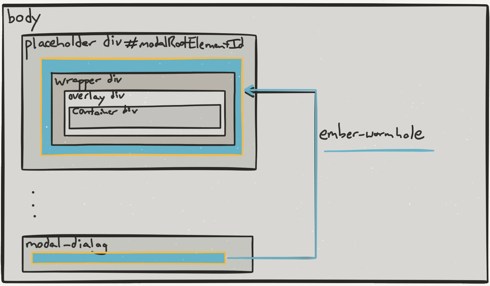
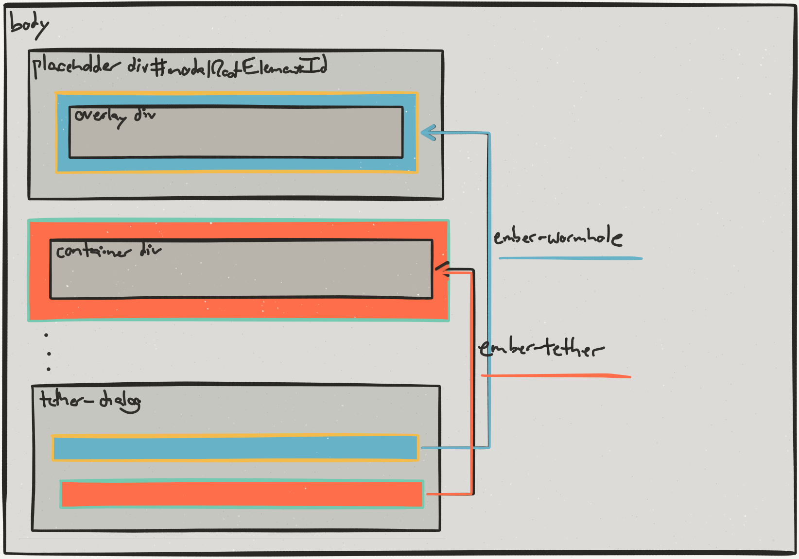

# Ember Modal Dialog [](https://travis-ci.org/yapplabs/ember-modal-dialog) [](http://emberobserver.com/addons/ember-modal-dialog)

The ember-modal-dialog addon provides components to implement modal dialogs throughout an Ember application using a simple, consistent pattern.

Unlike other modal libraries for Ember, ember-modal-dialog uses our [ember-wormhole](//github.com/yapplabs/ember-wormhole) addon to render a modal structure as a top-level DOM element for layout purposes while retaining its logical position in the Ember view hierarchy. This difference introduces a certain elegance and, dare we say, joy, into the experience of using modals in your app. For more info on this, see the "Wormhole" section below.

## Live Demo and Test Examples

View a live demo here: [http://yapplabs.github.io/ember-modal-dialog/](http://yapplabs.github.io/ember-modal-dialog/)

Test examples are located in `tests/dummy/app/templates/application.hbs` and can be run locally by following the instructions in the "Installation" and "Running" sections below.

## Including In An Ember Application

Here is the simplest way to get started with ember-modal-dialog:

```sh
ember install ember-modal-dialog
```

*Note:* Ember CLI versions < 0.2.3 should use `ember install:addon` instead of `ember install`

**application.hbs**
```htmlbars
{{#modal-dialog}}
  Oh hai there!
{{/modal-dialog}}
```

## Controller-bound Usage

Here is a more useful example of how to conditionally display a modal based on a user interaction.

**Template**

```htmlbars
<button {{action "toggleModal"}}>Toggle Modal</button>

{{#if isShowingModal}}
  {{#modal-dialog close="toggleModal"
                  targetAttachment="center"
                  translucentOverlay=true}}
    Oh hai there!
  {{/modal-dialog}}
{{/if}}
```

**Controller**

```javascript
import Ember from 'ember';

export default Ember.Controller.extend({
  isShowingModal: false,
  actions: {
    toggleModal: function() {
      this.toggleProperty('isShowingModal');
    }
  }
});
```

## Routable Usage

To have a modal open for a specific route, just drop the `{{modal-dialog}}` into that route's template. Don't forget to have an `{{outlet}}` on the parent route.

## Configurable Properties

### modal-dialog

The modal-dialog component supports the following properties:

Property              | Purpose
--------------------- | -------------
`translucentOverlay`  | Indicates translucence of overlay, toggles presence of `translucent` CSS selector
`target`              | Element selector, element, or Ember View reference for that serves as the reference for modal position (default: `'body'`)
`close`               | The action handler for the dialog's `close` action. This action triggers when the user clicks the modal overlay.
`renderInPlace`       | A boolean, when true renders the modal without wormholing or tethering, useful for including a modal in a style guide
`clickOutsideToClose` | Indicates whether clicking outside a modal without an overlay should close the modal. Useful if your modal isn't the focus of interaction, and you want hover effects to still work outside the modal.
`attachment`          | A string of the form 'vert-attachment horiz-attachment', e.g. `'middle left'` (see "Positioning" section below)
`targetAttachment`    | A string of the form 'vert-attachment horiz-attachment', e.g. `'middle left'` (see "Positioning" section below)
`container-class`     | CSS class name(s) to append to container divs. Set this from template.
`containerClassNames` | CSS class names to append to container divs. This is a concatenated property, so it does **not** replace the default container class (default: `'ember-modal-dialog'`. If you subclass this component, you may define this in your subclass.)
`overlay-class`       | CSS class name(s) to append to overlay divs. Set this from template.
`overlayClassNames`   | CSS class names to append to overlay divs. This is a concatenated property, so it does **not** replace the default overlay class (default: `'ember-modal-overlay'`. If you subclass this component, you may define this in your subclass.)
`wrapper-class`       | CSS class name(s) to append to wrapper divs. Set this from template.
`wrapperClassNames`   | CSS class names to append to wrapper divs. This is a concatenated property, so it does **not** replace the default container class (default: `'ember-modal-wrapper'`. If you subclass this component, you may define this in your subclass.)

### tether-dialog

The tether-dialog component supports all of the modal-dialog properties specified above as well as the following properties:

Property              | Purpose
--------------------- | -------------
`hasOverlay`          | Toggles presence of overlay div in DOM
`tetherClassPrefix`   | Proxies to Hubspot Tether*
`offset`              | Proxies to Hubspot Tether*
`targetOffset`        | Proxies to Hubspot Tether*

* Please see [Hubspot Tether](http://github.hubspot.com/tether/) for usage documentation.


## Which Component Should I Use?

Various modal use cases are best supported by different DOM structures. Ember Modal Dialog provides the following components:

- modal-dialog: Uses ember-wormhole to append the following nested divs to the destination element: wrapper div > overlay div > container div

    

- tether-dialog: Uses ember-tether to display modal container div. Uses ember-wormhole to append optional overlay div to the destination element. Requires separate installation of [ember-tether](//github.com/yapplabs/ember-tether) dependency.

    

## Positioning

Ember Modal Dialog provides `attachment` and `targetAttachment` properties to configure positioning of the modal dialog near its target. To provide consistency with Hubspot Tether, Ember Modal Dialog uses the same syntax for these properties: "top|middle|bottom left|center|right"... e.g. `'middle left'`

### Positioning tether-dialog Components

The tether-dialog component uses our [ember-tether](//github.com/yapplabs/ember-tether) addon, which in turn uses [Hubspot Tether](http://github.hubspot.com/tether/). This enables modals to remain positioned near their targets when users scroll or resize the window.

To enable this behavior, install ember-tether as a dependency of **your ember app**.

    `ember install ember-tether`

Then use the tether-dialog component for any modals you wish to position this way:

```htmlbars
{{#tether-dialog
  target='#target-element-id'
  targetAttachment='middle right'
  attachment='middle left'}}
  I am a modal that will remain tethered to the right of the element with id 'target-element-id'
{{/tether-dialog}}
```

#### Caveats

Event delegation originating from content inside ember-tether blocks will only work for Ember apps that use Ember's default root element of the `body` tag. This is because the Hubspot Tether library appends its positioned elements to the body tag.

If you are not overriding the default root element, then don't worry and carry on. ember-tether will work just fine for you.

### Positioning modal-dialog Components

The modal-dialog component uses an internal ember-modal-dialog-positioned-container component to position modals near their targets. This is a good option if you do not wish to use Ember Tether + Hubspot Tether. Just know that this positioning logic is not nearly as sophisticated as the positioning logic in Ember Tether. That's why we made Ember Tether.

NOTE: The {{ember-modal-dialog-positioned-container}} component only respects the horizontal value for `targetAttachment`. So, for example,`'top left'`, `'middle left'`, and `'bottom left'` will all be interpreted simply as `'left'`. We will gladly accept [PRs](https://github.com/yapplabs/ember-modal-dialog/pulls) for improvements here.

## Wormholes

Display of a modal dialog is typically triggered by a user interaction. While the content in the dialog is related to the content in the user interaction, the underlying display mechanism for the dialogs can be shared across the entire application.

The `add-modals-container` initializer appends a container element to the `application.rootElement`. It injects a reference to this container element id as a property of the `modal-dialog` service, which is then used in the `modal-dialog` component. The property is injected into a service instead of directly into the `modal-dialog` component to make it easier to extend the component and make custom modals.

ember-modal-dialog uses ember-wormhole to append modal overlays and contents to a dedicated element in the DOM. This decouples the DOM location of a modal from the DOM location of whatever triggered its display... hence wormholes!

## Configuring the Modal Root Element Id

This default id of the modal root element is `modal-overlays` and can be overridden in environment application options as follows:

**environment.js**
```javascript
module.exports = function(environment) {
  var ENV = {
    // ...
    APP: {
      // ...
      emberModalDialog: {
        modalRootElementId: 'custom-modal-root-element'
      }
    }
  };
  // ...

  return ENV;
};
```

## Configuring Styles

The addon packages default styles for modal structure and appearance, see `addon.css`.

## Keyboard shortcuts

A quick-and-dirty way to implement keyboard shortcuts (e.g. to dismiss your modals with `escape`) is to subclass the dialog and attach keyboard events:

```js
// app/components/modal-dialog.js
import ModalDialog from 'ember-modal-dialog/components/modal-dialog';

export default ModalDialog.extend({
  setup: function() {
    Ember.$('body').on('keyup.modal-dialog', (e) => {
      if (e.keyCode === 27) {
        this.sendAction('close');
      }
    });
  }.on('didInsertElement'),

  teardown: function() {
    Ember.$('body').off('keyup.modal-dialog');
  }.on('willDestroyElement')
});
```

This can work, but some apps require a more sophisticated approach. One approach, inspired by Cocoa, takes advantage of the [ember-key-responder](https://github.com/yapplabs/ember-key-responder) library. Here's an example:

```javascript
// app/components/modal-dialog.js
import ModalDialog from 'ember-modal-dialog/components/modal-dialog';

export default ModalDialog.extend({
  acceptsKeyResponder: true,
  becomeKeyResponderWhenInserted: function() {
    this.becomeKeyResponder();
  }.on('didInsertElement'),

  resignKeyResponderWhenDestroyed: function() {
    this.resignKeyResponder();
  }.on('willDestroyElement'),

  cancel: function() {
    this.sendAction('close');
  }
});
```

View [the library](https://github.com/yapplabs/ember-key-responder) for more information.

## iOS

In order for taps on the overlay to be functional on iOS, a `cursor: pointer` style is added to the `div` when on iOS. If you need to change this behavior, subclass modal-dialog and override `makeOverlayClickableOnIOS`.

## Custom Modals

If you have various different styles of modal dialog in your app, it can be useful to subclass the dialog as a new component:

```js
// app/components/full-screen-modal.js

import ModalDialog from 'ember-modal-dialog/components/modal-dialog';

export default ModalDialog.extend({
  containerClassNames: "full-screen-modal",
  targetAttachment: "none"
});
```

This can then be used like so:

```htmlbars
{{#full-screen-modal}}
  Custom modal contents
{{/full-screen-modal}}
```

## Dependencies

* Requires Ember CLI >= 0.2.0
* Requires Ember >= 1.10.0 (Due to a bug in these versions of Ember, you may have trouble with Ember 1.13.7, 1.13.8 and 1.13.9 -- See #71)

## Installation

* `ember install ember-modal-dialog`

Or, in Ember CLI versions < 0.2.3:

```sh
ember install:addon ember-modal-dialog
```

## Running

* `ember server`
* Visit your app at http://localhost:4200.

## Running Tests

* `ember try:testall`
* `ember test`
* `ember test --server`

## Unit Tests

When running unit tests on components that use ember-modal-dialog it is necessary to create and register the container for ember-modal-dialog to wormhole itself into.  See this [example](tests/unit/components/component-that-uses-modal-dialog-test.js) for how to set this up in a unit test.

## Building

* `ember build`

For more information on using ember-cli, visit [http://www.ember-cli.com/](http://www.ember-cli.com/).

## Generating the Changelog

This project uses [https://github.com/skywinder/github-changelog-generator](https://github.com/skywinder/github-changelog-generator) to generate its changelog.

## Additional Resources

* [Screencast on using ember-modal-dialog](https://www.emberscreencasts.com/posts/74-ember-modal-dialog)

## Credits

Contributions from @stefanpenner, @krisselden, @chrislopresto, @lukemelia, @raycohen and
others. [Yapp Labs](http://yapplabs.com) is an Ember.js consultancy based in NYC.
